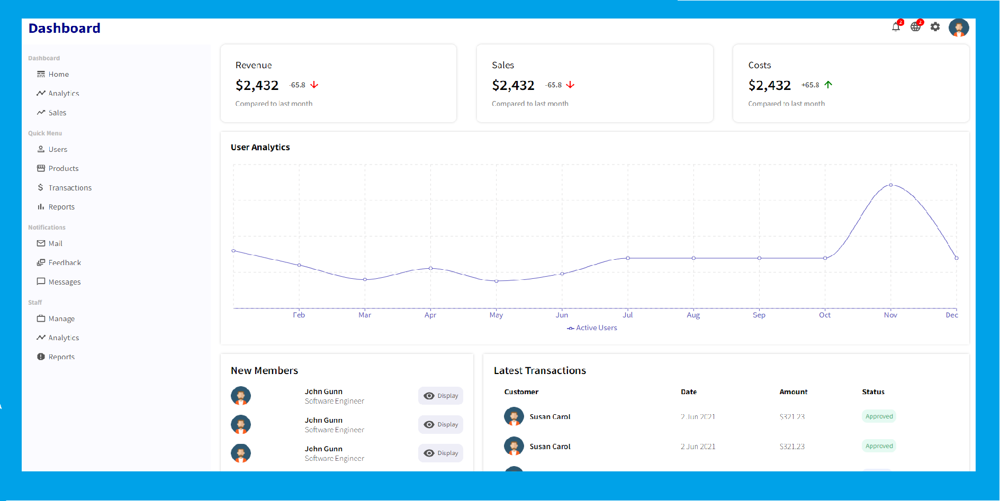

# React Admin Dashboard

Simple Admin DashBoard Using React

## Build Steps ⚙

This project was built with NodeJs -v 14.xx. Packages used includes:

    1.react ^17.0.2
    2.react-dom ^17.0.2
    3.react-router-dom ^5.2.0
    4.react-scripts 4.0.3
    5.recharts ^2.0.10
    

Running Locally 🖥️
1. Clone repo using the following command:
    ```shell script
    git clone https://github.com/Itsyaboikris/react-admin-dashboard.git
    ```
2. cd in project directory
4. Install dependencies
    ```shell script
    npm install --save
    ```
5. Run project 🎉
    ```shell script
    npm start
    ```
